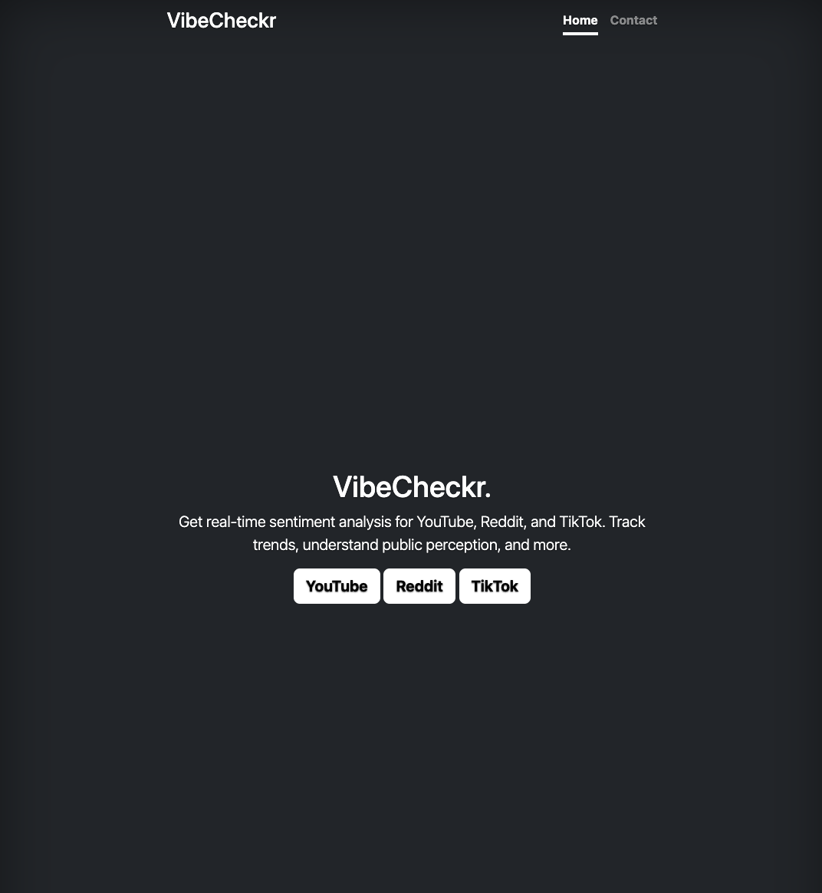
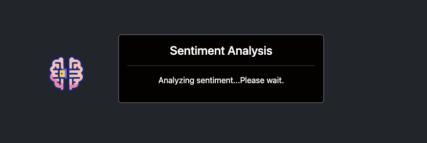
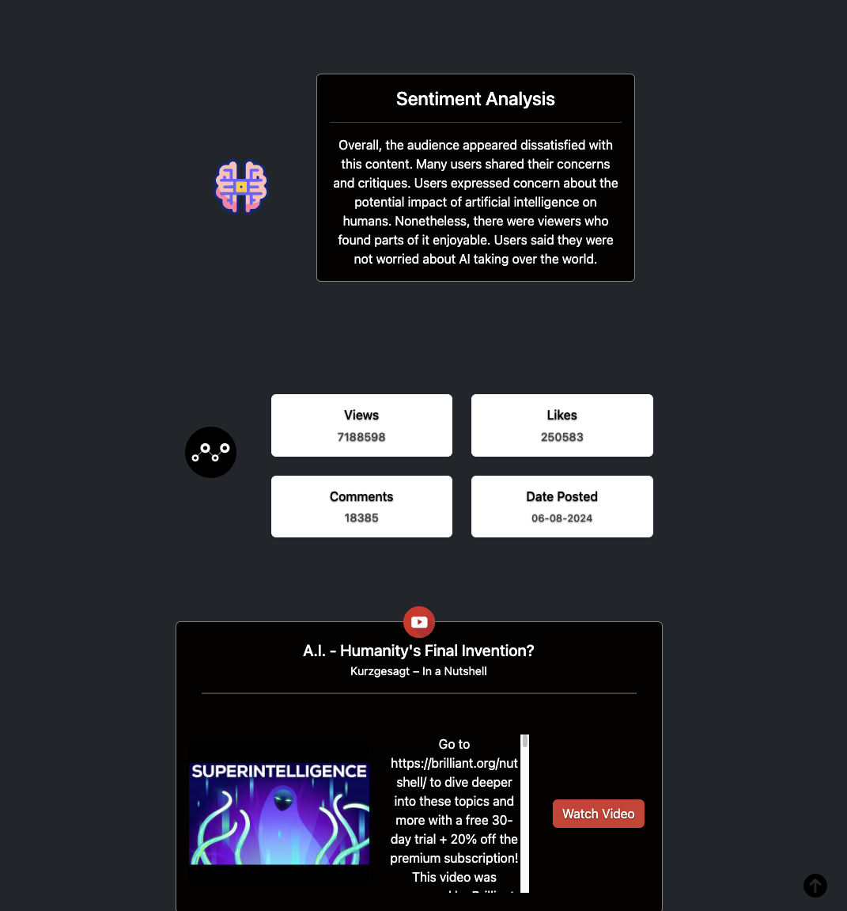

# VibeCheckr - Sentiment Analysis Web App

VibeCheckr is a web application that provides sentiment analysis for comments on YouTube videos and Reddit posts. It utilizes APIs and machine learning to generate summaries and insights into the sentiment expressed in user-generated content.

---

## Features

- **Sentiment Analysis**: Analyze the tone of YouTube comments and Reddit discussions.
- **Summarization**: Generate user-friendly summaries of the analyzed content.
- **API Integration**:
  - YouTube Data API v3 for fetching video details and comments.
  - Reddit API (PRAW) for fetching post details and comments.
- **User-Friendly Interface**: Simple and clean design for easy navigation.
- **Customizable**: Extendable to other platforms and additional features.

---

## Installation

### Prerequisites
- Python 3.8 or higher
- pip (Python package installer)
- A virtual environment tool (e.g., `venv`)

### Setup Instructions

1. **Clone the Repository**:
   ```bash
   git clone https://github.com/yourusername/vibecheckr.git
   cd vibecheckr
2. **Set Up a Virtual Environment**:

    ```bash

    python3 -m venv venv
    source venv/bin/activate  # On macOS/Linux
    venv\Scripts\activate     # On Windows
3. **Install Dependencies**:

    ```bash

    pip install -r requirements.txt
    

4. **Set Up Environment Variables**:

     Create a .env file in the project root and add the following:


    FLASK_APP=main.py
    FLASK_ENV=development
    SECRET_KEY=your_secret_key
    YOUTUBE_API_KEY=your_youtube_api_key
    REDDIT_CLIENT_ID=your_reddit_client_id
    REDDIT_SECRET=your_reddit_secret
5. **Run the Application**:

    ```bash
    flask run
6. **Access the App**: 
Open your browser and navigate to http://127.0.0.1:5000.

## Using the Trained Model

The trained model is not included in the repository due to size limitations. You can download it from [Google Drive](https://drive.google.com/drive/folders/1ow-7NTdGmyHu9JAb7A76wh-VY2v_YftR?usp=sharing) and place it in the `trained_model/` directory to use it with this project.


---
### Usage

1. **Analyze Comments**:

- Enter the URL of a YouTube video or Reddit post on the home page.

- Click "Analyze" to retrieve and analyze comments.

2. **View Results**:

- Sentiment summary and stats (positive, negative, neutral) will be displayed.

- Summarized insights provide an overview of user sentiment.
3. **Contact Page**:

- Report issues or send feedback via the "Contact" page.

---

### Screenshots
### Home Page


### Generating Summary



### Sentiment Analysis Results



---

### Technologies Used
**Backend**: Flask


**Frontend**: HTML, CSS (Bootstrap 5)


**APIs**:
- YouTube Data API v3
- Reddit API (PRAW)

**Machine Learning**:
- Hugging Face Transformers (Pegasus)
- SpaCy for sentiment analysis
- Google Colab for model training

**Deployment**: Heroku

**Database**: None 

---

### Future Features
- Support for additional platforms (eg.TikTok)
- Advanced sentiment metrics

---

### Contributing
Contributions are welcome!

### How to Contribute

1. **Fork the Repository**:
   - Click the **Fork** button at the top of this repository to create your copy.

2. **Clone Your Fork**:
   - Clone your forked repository to your local machine:
     ```bash
     git clone https://github.com/yourusername/vibecheckr.git
     cd vibecheckr
     ```

3. **Create a Branch**:
   - Create a new branch for your feature or fix:
     ```bash
     git checkout -b feature-name
     ```

4. **Make Your Changes**:
   - Make the necessary code changes.
   - Add or modify tests if applicable.

5. **Commit Your Changes**:
   - Stage your changes and commit them with a meaningful message:
     ```bash
     git add .
     git commit -m "Add feature-name or Fix issue"
     ```

6. **Push Your Branch**:
   - Push the changes to your forked repository:
     ```bash
     git push origin feature-name
     ```

7. **Submit a Pull Request**:
   - Go to the original repository on GitHub.
   - Click **Pull Requests** and then **New Pull Request**.
   - Select your branch and describe your changes in the pull request.


### Contact
For feedback, questions, issues please reach out:
- **Email**: Lycheeloopcode@gmail.com
- **GitHub**: LycheeLoop
